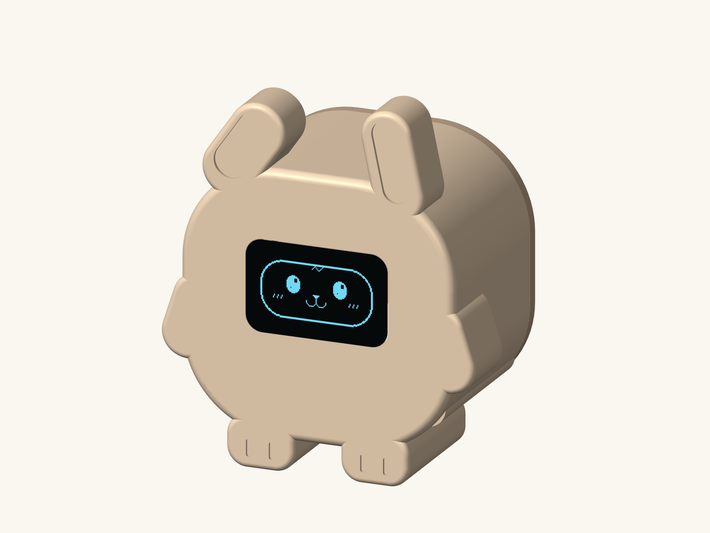
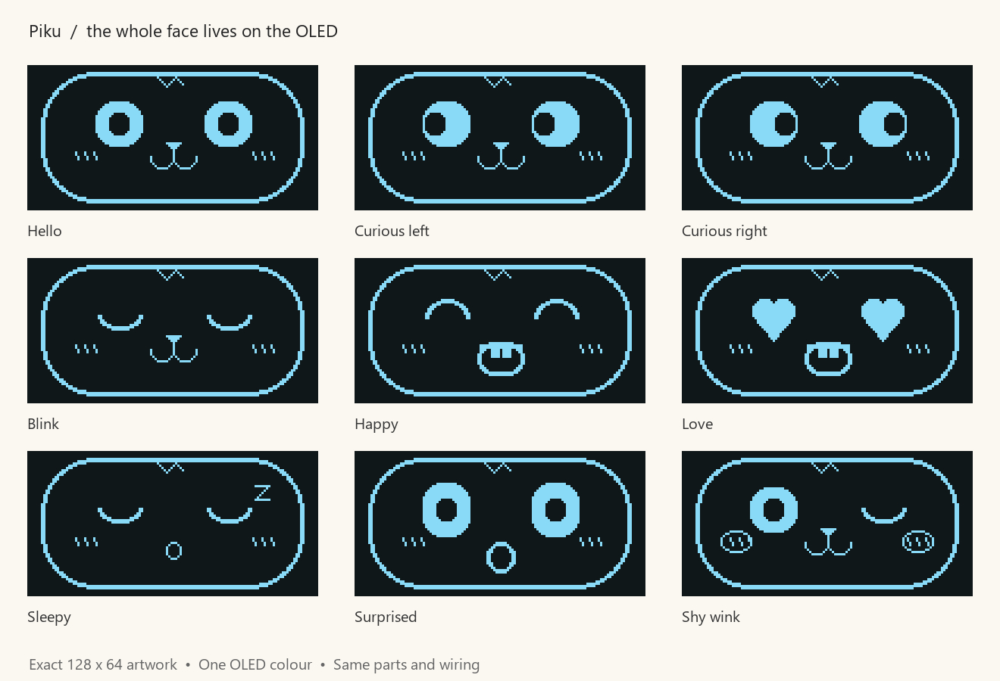

# Piku 🐰

**A tiny, sleepy bunny for your desk.**

USB powered · Touch reactive · About 6.4 cm tall

[Build guide](Piku-build-guide.docx) · [Download the project](https://github.com/Saitejas21/piku-desk-robot/archive/refs/heads/main.zip) · [Print files](cad)

CAD preview of the proposed build. The first physical build is still to be tested.

Piku is a small ESP32 hobby robot with one tilted ear, little paws, and a whole face on a monochrome OLED: eyes, nose, mouth, and cheeks. Its body stays still while its expressions do the talking.

The build uses **three small boards and two printed parts**. Start with one little win: get Piku's face blinking on the table. Put it in its bunny shell once the electronics work.

## Meet Piku

| What you do | What Piku does |
| --- | --- |
| Let it hang out | Blinks and glances left and right |
| Tap its head | Smiles |
| Double-tap within 450 ms | Shows heart eyes |
| Hold a touch for two seconds | Gives a shy wink |
| Leave it alone for a minute | Falls asleep |
| Touch it while sleeping | Wakes with a surprised face, then smiles |

These are the actual **128 × 64 pixel frames** included in the sketch. All features use the OLED's single pixel colour; the blue in the preview matches the linked display.

## Gather the little parts

Buy one of each board. **This shell and sketch are designed for the ESP32-C3 SuperMini and SSD1306 display below.**

| Part | What to look for | Buy |
| --- | --- | --- |
| ESP32-C3 SuperMini | HW-466AB, USB-C, with soldered headers | [Quartz Components](https://quartzcomponents.com/collections/nodemcu-esp/products/esp32-c3-super-mini-development-board-with-soldered-headers-hw-466ab) |
| 0.96″ OLED | SSD1306, 128 × 64, **four-pin I²C** | [Quartz Components](https://quartzcomponents.com/products/oled-display-0-96-inch-i2c-interface-4-pin-blue-ssd1306) |
| TTP223 touch sensor | Small **red 15 × 11 mm** board | [DNA Technology](https://www.dnatechindia.com/red-ttp-223-touch-switch-sensor-module-india.html) |

Also gather a USB-A to USB-C **data** cable, short female-to-female jumpers, thin hookup wire, two M2 × 6 mm self-tapping screws, thin double-sided tape, electrical tape, and small non-slip pads for the feet. You'll need access to a PLA printer or a printing service.

Borrow a soldering iron, solder, cutters, and a small screwdriver. Some headers and the shared power leads need soldering. Larger ESP32 boards and larger blue touch modules will not fit this shell. Servos are not part of this build.

The [four-page build guide](Piku-build-guide.docx) includes the shopping notes, budget, and assembly steps. Listing prices and stock can change.

## First win: a face on the table

1. Use **Code → Download ZIP** and extract the project.
2. Follow the [build guide](Piku-build-guide.docx) to wire the three boards on the table.
3. Install Arduino IDE, the ESP32 board package, and the display libraries. Open [`Piku.ino`](firmware/Piku/Piku.ino), keeping [`piku_faces.h`](firmware/Piku/piku_faces.h) beside it.
4. Upload, leave the touch pad alone for **two seconds**, then tap it to meet Piku.

<strong>Wiring, Arduino settings, and quick fixes</strong>

### Connect the boards

Unplug USB while wiring. Match the labels printed on each board.

| Module | Pin | ESP32-C3 connection |
| --- | --- | --- |
| OLED | VCC / VDD | 3V3 |
| OLED | GND | GND |
| OLED | SDA | GPIO4 |
| OLED | SCL / SCK | GPIO5 |
| TTP223 | VCC | 3V3 |
| TTP223 | GND | GND |
| TTP223 | OUT / I/O | GPIO3 |

Use short, soldered and insulated Y leads to share **3V3** and **GND** between the two modules. Both modules are powered from 3V3; neither connects to the ESP32's 5V pin. Set the TTP223 to **active-high momentary mode**, so its output is high only while touched.

### Upload Piku

1. Install [Arduino IDE](https://www.arduino.cc/en/software/) and the **esp32** board package by **Espressif Systems**. The [Espressif installation guide](https://docs.espressif.com/projects/arduino-esp32/en/latest/installing.html) covers setup.
2. In Library Manager, install **Adafruit SSD1306** and **Adafruit GFX Library**, including their dependencies.
3. Open `firmware/Piku/Piku.ino`. Select **ESP32C3 Dev Module**, **4 MB** flash, **USB CDC On Boot: Enabled**, and the connected port.
4. Upload using the data cable. Leave the touch pad alone for **two seconds** after power-up, then try a tap.

If the port is missing, try another data cable. To enter download mode, hold **BOOT**, tap **RESET**, release **BOOT**, and select the port again.

**Blank screen?** Check 3V3, GND, GPIO4, and GPIO5; the sketch tries addresses `0x3C` and `0x3D`. **Upside down?** Change `face.setRotation(0)` to `face.setRotation(2)`. **Touch stuck on?** Check momentary mode and move wires away from the sensing pad.

## Give Piku a home

Print **one of each** of these files:

| File | Orientation |
| --- | --- |
| [`piku_body.stl`](cad/piku_body.stl) | Face down, open back upward |
| [`piku_back.stl`](cad/piku_back.stl) | Exterior down, locating lip upward |

Use **PLA · 0.4 mm nozzle · 0.2 mm layers · 3 walls · 15% infill**, at **100% scale in millimetres**. The files already lie in their print orientations; supports should not be needed. The assembled shell is approximately **55 × 34 × 64 mm** including its ears and paws.

Measure your actual boards before printing. Align the lit OLED behind the opening, then mount the boards with tape as described in the guide. The touch sensor sits under the thin crown patch between the ears, toward the back. Close the lid with the two screws and tighten gently.

Cream or pastel PLA suits Piku. The inner ear recesses can be painted pink; leave the crown touch patch unpainted.

**Print only the body and back.** [`piku_assembly.step`](cad/piku_assembly.step) is an assembled CAD preview whose screen and face pixels are illustrative geometry.

## Tinker with Piku

- **Faces:** [`piku_faces.h`](firmware/Piku/piku_faces.h) holds the nine monochrome bitmaps.
- **Behaviour:** [`Piku.ino`](firmware/Piku/Piku.ino) controls blinking, touch reactions, and the sleep timer.
- **Shell:** The [`cad` folder](cad) includes STEP files and editable [build123d](https://github.com/gumyr/build123d) Python sources. The assembly reads [`piku_face_pixels.json`](cad/piku_face_pixels.json) for its face preview.

## Build status

Piku is an **early hobby prototype**. The [CAD validation results](cad/validation.json) report valid single solids for both print parts, closed STL meshes with consistent winding, and no positive-volume overlap between the body and lid.

The shell has **not been physically printed or fitted**. Test the electronics on the table before closing the shell.

The browser links in `cad/preview-links.md` point to the original author's local CAD viewer. To inspect the model on your own computer, open the included STEP or STL files in a CAD viewer or slicer.

## License

Original Piku CAD and firmware are available under the [MIT license](LICENSE.txt). Third-party libraries and the document template retain their own licenses.
