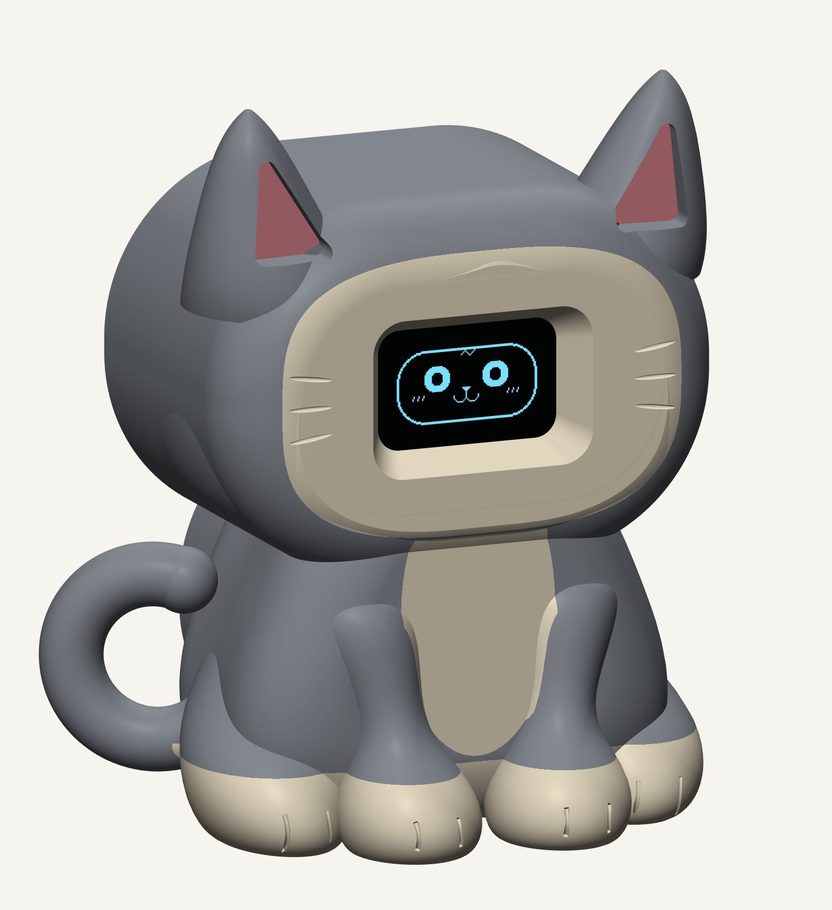
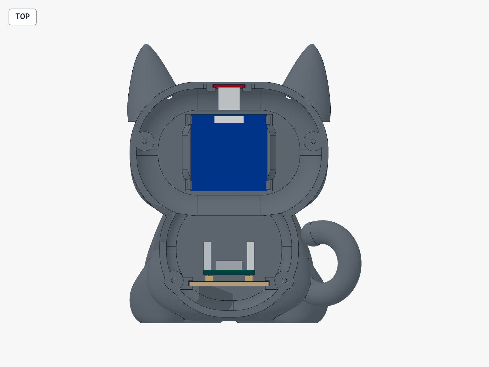

# Piku the little cat 🐱

A seated chibi kitten with pointed ears, short forelegs, tiny toe creases and a curled tail. **The whole animated face lives on the OLED.**

**About 82.5 mm wide × 55.0 mm deep × 98.3 mm tall**, including ears and tail. This is the refined cat variant: a smaller outer head and slightly taller torso, using the same OLED, touch sensor and ESP32-C3 SuperMini. There are no servos.

[Print files](cad) · [Firmware](firmware/Piku) · [Download image](Piku-cat-preview.png) · [Design notes](design-notes.md) · [Back to Piku](../../README.md)

The image is a render of the actual CAD with suggested paint colours and the existing OLED pixels. Paint does not add separate parts. The shell has no physical eyes, nose, mouth or muzzle. Printing and real module fit still need testing.

Open the [OLED-on assembly](cad/cat_assembly.step), [OLED-off assembly](cad/cat_shell_review.step) or [open-back assembly](cad/cat_inside.step) in a STEP viewer. Assemblies are for inspection; print the individual parts listed below.

The [proportion checks](cad/proportion-check.json) record an **8.0% reduction in outer head-envelope volume** and a **6.4% increase in sculpted torso height** against the earlier cat. The free electronics cavity, display hardware and mounts, central touch crown, removable tray and rear cover are unchanged. The bunny, slide-in bunny and otter remain separate variants.

## The same little parts

| Part | Where it goes | Guide's shopping link |
| --- | --- | --- |
| ESP32-C3 SuperMini HW-466AB | On the removable lower tray, USB facing the back | [Quartz Components](https://quartzcomponents.com/collections/nodemcu-esp/products/esp32-c3-super-mini-development-board-with-soldered-headers-hw-466ab) |
| 0.96″ SSD1306 OLED, 128 × 64, four-pin I²C | Behind the face opening | [Quartz Components](https://quartzcomponents.com/products/oled-display-0-96-inch-i2c-interface-4-pin-blue-ssd1306) |
| Small red TTP223, 15 × 11 mm | Slides beneath the crown, between the ears | [DNA Technology](https://www.dnatechindia.com/red-ttp-223-touch-switch-sensor-module-india.html) |

Also gather a USB-C **data** cable, short jumper wires, thin hookup wire, insulating mounting tape, **four M2 × 6 mm self-tapping screws** and small non-slip pads. Optional small cable ties can hold the C3 on its tray. Keep them clear of its antenna, buttons, connector and components. Some headers and shared power leads may need soldering.

These are the same parts selected for the Piku guide. The model uses nominal board dimensions; measure the modules you receive before printing. Larger ESP32 boards, SPI displays and larger touch modules need different holders.

## What to print

Print **one body option, one rear cover and one C3 tray**. The ears, paws and tail are integral parts of the body. The rear cover, tray and fit-test prints are unchanged from the original cat revision.

| File | Use |
| --- | --- |
| [cat_body.stl](cad/cat_body.stl) | Four releasable OLED clips, touch rails and tray rails |
| [cat_body_tape.stl](cad/cat_body_tape.stl) | Alternative body with OLED corner supports and no OLED clips; use insulating tape |
| [cat_back.stl](cad/cat_back.stl) | Matching screwed cover, USB opening and fingers retaining the touch board and tray |
| [cat_c3_tray.stl](cad/cat_c3_tray.stl) | Removable tray with raised insulating-pad supports and optional tie slots |

**Try the small fit prints first:** the [OLED coupon](cad/cat_oled_fit_test.stl), [touch coupon](cad/cat_touch_fit_test.stl), and the actual C3 tray. Check clip grip, board clearances, the complete lit face, USB alignment and touch through the crown material.

For the clip version, start with **PETG · 0.4 mm nozzle · 0.2 mm layers · 3 walls · 15% infill**, at **100% scale in millimetres**. Use matching material and settings for coupons and final parts. The tape body can also be tried in PLA.

The individual STEP/STL files are already in print orientation. The body is face toward the bed, open back upward. **It needs supports beneath exterior features**, including recessed front surfaces, ears and the tail. Inspect the slicer preview and keep supports out of clip gaps and sliding channels where possible. The rear cover, tray and coupons sit flat. No slicer or physical print has been tested here.

Use a single filament colour to keep the sculpted outline visible. The ear recesses can be painted pink if desired, but the review views deliberately use no colour accents. All print STLs are single-material parts. Leave the thin crown sensing patch unpainted.

## Put the kitten together

1. **Get its face working on the table first.** Connect the three boards, upload the sketch and check touch reactions.
2. **Fit the OLED from the open back**, screen facing forward and header at the top. Align the lit face, then press only clear PCB corners to engage the tabs. Never press the glass or ribbon. If it binds, adjust the holder or use the tape body.
3. **Slide the red touch board forward into the crown rails.** Its long 15 mm side runs front-to-back. The sensing pad faces the crown, components face inside, and the header stays toward the rear.
4. **Tape the C3 onto the raised tray pads with insulating tape.** The nominal layout allows 0.4 mm mounting pads and 2.2 mm downward solder tails. Check your actual pins and header orientation. Slide the loaded tray into the lower rails with USB facing the opening.
5. **Wire and route the short leads in the free side space.** Keep wires clear of the touch patch, rear rim and screw bosses. Check that the USB plug enters without forcing the board.
6. **Attach the back with four screws**, tightened gently. Its fingers retain the touch board and C3 tray. For servicing, remove the cover, disconnect the required leads and slide the parts out. Remove the touch board before releasing the OLED tabs.

The [closed assembly](cad/cat_assembly.step) and [interior assembly](cad/cat_inside.step) show the nominal electronics and reserved connector/header space. **Do not print either assembly.** The coloured board solids are approximate fit envelopes, not additional parts or exact purchased-board models.

## Wiring and the first upload

Unplug USB while wiring and follow the labels printed on your boards.

| Connection | C3 pin |
| --- | --- |
| OLED VCC and touch VCC | 3V3, shared through an insulated Y lead |
| OLED GND and touch GND | GND, shared through an insulated Y lead |
| OLED SDA | GPIO4 |
| OLED SCL / SCK | GPIO5 |
| Touch OUT / I/O | GPIO3 |

Use active-high momentary mode on the touch board. In Arduino IDE, install the **esp32** board package by Espressif, **Adafruit SSD1306** and **Adafruit GFX Library**, including dependencies. Open [Piku.ino](firmware/Piku/Piku.ino) with [piku_faces.h](firmware/Piku/piku_faces.h) beside it. Choose **ESP32C3 Dev Module**, **4 MB** flash and **USB CDC On Boot: Enabled**, then upload using the data cable.

Leave the crown alone for two seconds after power-up, then tap it. Piku blinks and glances when idle, smiles on a tap, shows hearts on a double-tap, winks on a hold and sleeps after a quiet minute. Hello looks straight ahead; curious pupils move left or right. The [nine face frames](Piku-face-expressions.png) and firmware are unchanged from the existing Piku kit. Firmware has not been compiled or run on hardware here.

## Fit notes and editable CAD

| Interface | Nominal model assumption |
| --- | --- |
| OLED PCB | 27 × 27 × 1.2 mm; glass position and clear corner margins must be checked |
| Touch PCB | 11 × 15 × 1.0 mm; 1.3 mm rail slot |
| C3 PCB | 18 × 22.5 × 1.6 mm; headers and USB connector approximated |
| OLED clips | 0.25 mm side/axial allowances and 0.4 mm catch overlap |
| Crown | 0.8 mm central sensing wall; 0.15 mm nominal pad gap |
| Tray rails / lid lip | 0.3 mm nominal clearance |
| Rear USB opening | 16 × 14 mm; checked against a nominal 13 × 6 mm plug body |

The [validation report](cad/validation.json) records valid single print solids, closed and consistently wound meshes, nominal component clearances, wire corridors, insertion sweeps and selected display viewing angles. Flexible clip movement, real board fit, touch response and physical stability still need testing. Use the coupons; don't scale the entire cat to fix one holder.

Editable build123d Python sources sit beside their STEP files. Main parameters are in [cat_common.py](cad/cat_common.py). Raw coordinates use X for width, Y for standing height and +Z from front to back; generators transform each printable part onto the bed. The rear mating datum and screw centres are shared parameters. The sources were generated with build123d 0.11.1. Run [validate_cat.py](tools/validate_cat.py) with build123d after regenerating changed geometry. The [face generator](tools/generate_faces.py) uses Pillow 10.1+.

This version is **USB powered**. The validation includes an empty 24 × 20 × 6 mm envelope in the belly, but no battery, charger or battery mounting system has been selected or fitted.

The [CAD renderer](tools/render_comparison.py) recreates the painted preview from the actual model. Run `python tools/render_comparison.py --single` with build123d and VTK installed. Run it without flags to regenerate the front, side and painted proportion comparisons from the earlier source snapshot in `baseline/cad/`. The snapshots use build123d 0.11.1 and VTK 9.6.2.

Original Piku CAD and firmware are under the [MIT license](LICENSE.txt).
