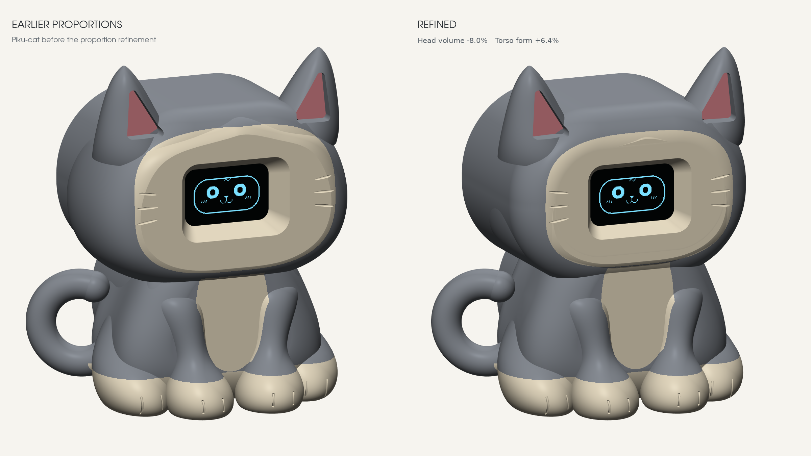

# Cat shape and proportions

Piku keeps a soft seated-cat silhouette: broad pointed ears, cheeks around the OLED, shaped forelegs that widen into planted paws, folded haunches, shallow toe creases and a curled side tail. Grey, cream and pink are paint suggestions, not multi-material STL parts.

## Refined proportions

| Measurement | Earlier cat | Published cat |
| --- | --- | --- |
| Closed outer head envelope, excluding ears | 133.22 cm³ | 122.55 cm³, **8.0% smaller** |
| Maximum head width, excluding ears | 76.66 mm | 70.00 mm |
| Sculpted torso-envelope height | 50.07 mm | 53.26 mm, **6.4% taller** |
| Overall height with ears | 98.30 mm | 98.30 mm |
| Usable electronics cavity | 145.72 cm³ | 145.72 cm³ |

Head volume is measured before cavity subtraction. Only the cosmetic outer form changes; the OLED itself is not scaled. The torso measurement describes its sculpted envelope, while visible chest height also depends on overlap with the head.

The ears, forelegs/paws, haunches and tail retain their previous geometry. The cream face surround is slightly smaller and the shallow whisker details follow it. The earlier CAD source snapshot in `baseline/cad/` supports reproducible comparison renders.

[Front, OLED off](previews/comparison-front.png) · [Three-quarter, OLED off](previews/comparison-three-quarter.png) · [Side, OLED off](previews/comparison-side.png)

## Fit and validation

The [proportion-study report](cad/proportion-check.json) is the validation snapshot made before publication. It records zero symmetric difference between the old and refined free cavities and between their central touch-crown patches, unchanged hardware/limb helpers, and unchanged rear cover, C3 tray and fit-test parts. Its original-file hash check refers to the preserved source workspace at the time of that comparison.

The [geometry validation](cad/validation.json) records valid single print solids, closed and consistently wound STL meshes, no nominal component interference, clear USB and wiring paths, module insertion sweeps and selected OLED viewing angles. These CAD checks do not establish physical clip action, print support quality, touch response or real board fit. Follow the build guide and print the fit coupons first.

## Form references

[Knitted Cat by Smoggy3D](https://makerworld.com/en/models/1085872-knitted-cat) informed the compact seated proportions and integrated pointed ears. [CaT-Rex by DjangoUnnamed](https://makerworld.com/en/models/1706146-cat-rex), a kitten in a dinosaur costume, informed the short forelegs, broad paws and tucked hips. Only general cat form cues were studied; no reference meshes were downloaded, copied or included. Piku uses smooth surfaces and keeps its entire face on the OLED.
