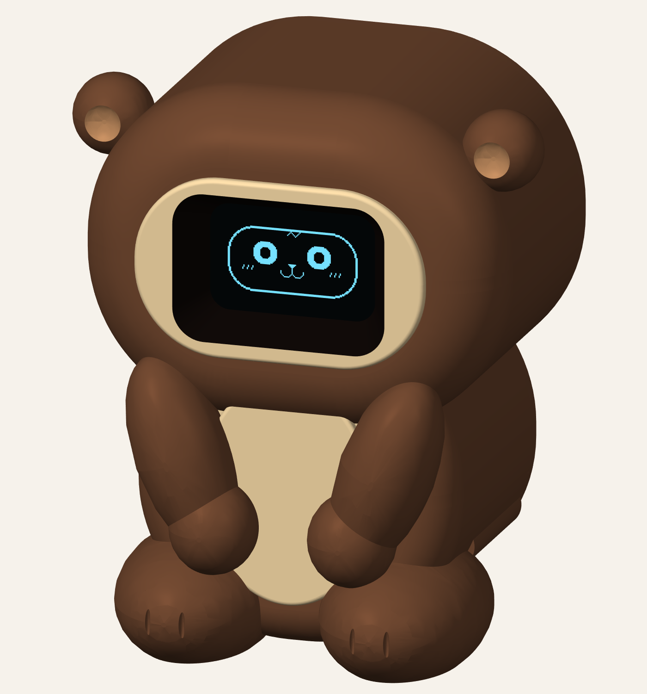
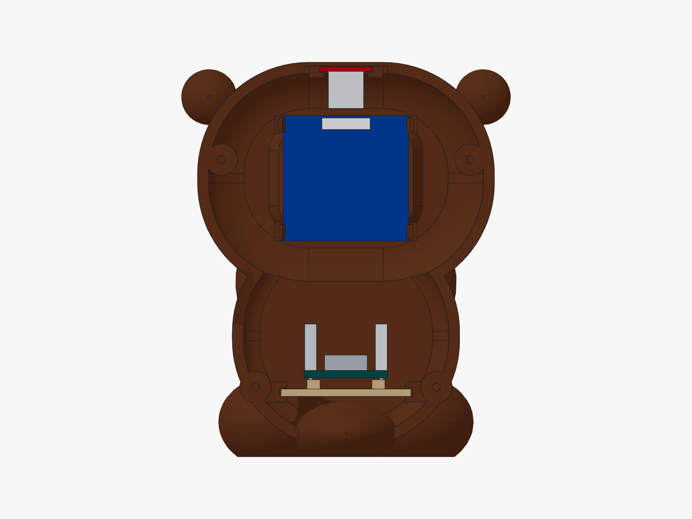

# Piku the little otter

A smooth, seated otter for the same tiny Piku electronics. Big round head, small ears, paws resting over a cream belly, little feet and a low tail. Its **whole face still lives on the OLED**.

**About 71 mm wide × 66 mm deep × 85 mm tall.** The main closed body is about 51 mm deep; the tail adds the rest. Brown filament with a cream-painted muzzle surround and belly gives the reference's colour pattern. The preview shows suggested paint on the actual CAD geometry, not a knitted texture or a photograph of a built robot.

This is a separate otter variant. The [original bunny](../../README.md) and its [optional push-in mounts](../slide-in/README.md) remain available.

[Print files](cad) · [Firmware](firmware/Piku) · [Model previews](cad/preview-links.md)

## Same three little boards

| Part | Inside the otter | Buy the guide's part |
| --- | --- | --- |
| ESP32-C3 SuperMini HW-466AB | On a removable tray in the lower body, USB facing the rear | [Quartz Components](https://quartzcomponents.com/collections/nodemcu-esp/products/esp32-c3-super-mini-development-board-with-soldered-headers-hw-466ab) |
| 0.96″ SSD1306, 128 × 64, four-pin I²C OLED | Behind the cream face surround, with clips or tape pads | [Quartz Components](https://quartzcomponents.com/products/oled-display-0-96-inch-i2c-interface-4-pin-blue-ssd1306) |
| Small red TTP223 touch module, 15 × 11 mm | In sliding rails under the thin crown | [DNA Technology](https://www.dnatechindia.com/red-ttp-223-touch-switch-sensor-module-india.html) |

Also use a USB-C **data** cable, short jumper wires, thin insulating mounting tape, four M2 × 6 mm self-tapping screws and small non-slip pads. Optional small cable ties can secure the C3 on its tray; route them clear of its buttons, antenna, USB connector and components. There are no servos.

## Choose the OLED holder

- **Push-in clips:** use [otter_body.stl](cad/otter_body.stl). The four tabs catch the exposed PCB corner edges. Release the tabs gently to remove the display.
- **Tape option:** use [otter_body_tape.stl](cad/otter_body_tape.stl). It has the same corner supports and front surround, with the OLED clips omitted. Secure only clear PCB margins using thin insulating mounting tape.

Both bodies use the same touch rails, C3 tray and rear cover. **Print one body option, one [back](cad/otter_back.stl), and one [C3 tray](cad/otter_c3_tray.stl).** The tail and paintable accents are already part of the body, so they need no separate printing or assembly.

## Print the small fit tests first

| File | Check |
| --- | --- |
| [OLED test](cad/otter_oled_fit_test.stl) | PCB thickness, corner clearance, clip grip and visibility of the complete lit face |
| [Touch test](cad/otter_touch_fit_test.stl) | Sliding fit and touch response through the crown wall |
| [C3 tray](cad/otter_c3_tray.stl) | Board placement, pin-end clearance and USB alignment; this is the actual removable tray |

Use **PETG, a 0.4 mm nozzle, 0.2 mm layers, 3 walls and 15% infill**, at **100% scale in millimetres**, as starting settings for the clip version. Use the same material and settings for the fit tests and final body. The tape body can also be tried in PLA. These are starting settings; the model has not been sliced or printed on your printer.

The STL and individual part STEP files are already in print orientation. The main body sits **face toward the bed, back opening upward**. Its rounded face, paws and belly have different front depths, so **it needs supports under exterior surfaces**. Inspect the slicer preview and keep supports out of the clip gaps and sensor channels where possible. The rear cover, tray and fit tests sit flat. Check the small rail ledges and latch ramps in the coupons before committing to the whole body.

Paint the raised muzzle surround and belly cream if desired. A dark inside edge around the face opening hides reflections. Leave the thin crown sensing patch unpainted. The body, back and tray STLs are single-material parts; the colour preview is a painting suggestion.

## Put the little otter together

1. **Test the electronics on the table first.** Upload the included Piku sketch and check the full face and touch reactions.
2. **Fit the OLED from the open back**, display facing forward and header at its upper edge. Align the lit face. Press only clear PCB corners when fitting clips, never the glass or ribbon. If it binds, stop and adjust the holder dimensions or choose the tape body.
3. **Slide the red touch board into the crown rails** from the rear. Its long 15 mm direction runs front-to-back; the sensing pad faces the crown and the header stays at the rear. Keep its component side facing the interior.
4. **Attach the C3 to its tray with insulating tape on the raised pads.** The nominal model allows a 0.4 mm mounting pad and 2.2 mm downward solder tails. Check your actual header orientation and pin lengths. Slide the loaded tray into the lower rails, checking the USB connector lines up with the rear opening. The rails grip the plastic tray; the PCB stays on its adjustable mounting pads.
5. **Connect the short leads and tuck them into the free side space.** Keep wiring away from the thin touch patch and out of the rear cover's mating rim. Verify the USB plug can enter freely.
6. **Fit the back around the low tail and fasten the four screws gently.** Its fingers retain both the touch board and the C3 tray. To service Piku, remove the cover, disconnect the necessary leads, then withdraw the tray or touch board. Remove the touch board before releasing the OLED tabs.

The blue/red/teal solids in the [interior STEP](cad/otter_inside.step) are nominal board envelopes. Grey boxes reserve room for headers, connectors and components; they are not exact purchased-part models or additional parts to buy. [The closed assembly](cad/otter_assembly.step) shows the standing character and its actual firmware face pixels. **Do not print either assembly.**

## Wire and upload

Unplug USB while wiring. Match the labels printed on the boards.

| Connection | C3 pin |
| --- | --- |
| OLED VCC and touch VCC | 3V3, shared through an insulated Y lead |
| OLED GND and touch GND | GND, shared through an insulated Y lead |
| OLED SDA | GPIO4 |
| OLED SCL / SCK | GPIO5 |
| Touch OUT / I/O | GPIO3 |

Use active-high momentary mode on the touch board. Open [firmware/Piku/Piku.ino](firmware/Piku/Piku.ino), keeping [piku_faces.h](firmware/Piku/piku_faces.h) beside it. Install the ESP32 Arduino board package plus Adafruit SSD1306 and Adafruit GFX Library. Choose **ESP32C3 Dev Module**, **4 MB** flash and **USB CDC On Boot: Enabled**. Upload with the data cable. Leave the crown alone for two seconds after power-up, then tap it.

The included firmware and nine [face expressions](Piku-face-expressions.png) are unchanged from Piku: idle blink/glances, tap to smile, double-tap for hearts, hold for a shy wink, and sleep after a quiet minute. It has not been compiled or run on hardware here.

## Fit assumptions and checks

| Interface | Model assumption |
| --- | --- |
| OLED PCB | 27 × 27 × 1.2 mm; glass and active-area position nominal |
| Touch PCB | 11 × 15 × 1.0 mm; 1.3 mm rail slot |
| C3 PCB | 18 × 22.5 × 1.6 mm; USB and header geometry nominal |
| OLED clips | 0.25 mm side allowance, 0.25 mm axial allowance, 0.4 mm catch overlap |
| Crown sensing wall | 0.8 mm at centre; nominal sensor gap 0.15 mm |
| C3 tray rails / lid lip | 0.3 mm nominal clearance |
| Rear cable opening | 16 × 14 mm; checked against a nominal 13 × 6 mm plug body |

The [OLED seller](https://quartzcomponents.com/products/oled-display-0-96-inch-i2c-interface-4-pin-blue-ssd1306) gives approximate 27 × 27 × 4.1 mm overall module dimensions, and the [touch seller](https://www.dnatechindia.com/red-ttp-223-touch-switch-sensor-module-india.html) lists 15 × 11 mm. The PCB thicknesses, clear corner margins, C3 footprint and detailed connector geometry above remain fit assumptions. Measure received modules and use the coupons; don't scale the whole otter to fix one holder.

The [validation report](cad/validation.json) records print-solid and mesh checks, assembled clearances, insertion paths and selected OLED viewing angles. It also checks space reserved for wiring. The flexible click action is not simulated, and physical print, fit and touch performance still need testing. Run [tools/validate_otter.py](tools/validate_otter.py) with build123d to repeat the geometric checks after changing dimensions. Editable sources are beside the STEP files; key dimensions live in [otter_common.py](cad/otter_common.py).

## Battery later

This kit is USB powered. The layout includes a checked **24 × 20 × 6 mm spare envelope** in the belly, clear of the modeled boards and reserved wire lanes. It is **not a selected or mounted battery**, and it does not establish space for a complete charging system. A rechargeable version still needs a chosen protected cell, matching charger/power circuit, mounting and a connector layout before it can be called fitted.

Original Piku CAD and firmware are under the [MIT license](LICENSE.txt). The bunny kits are separate and unchanged.
