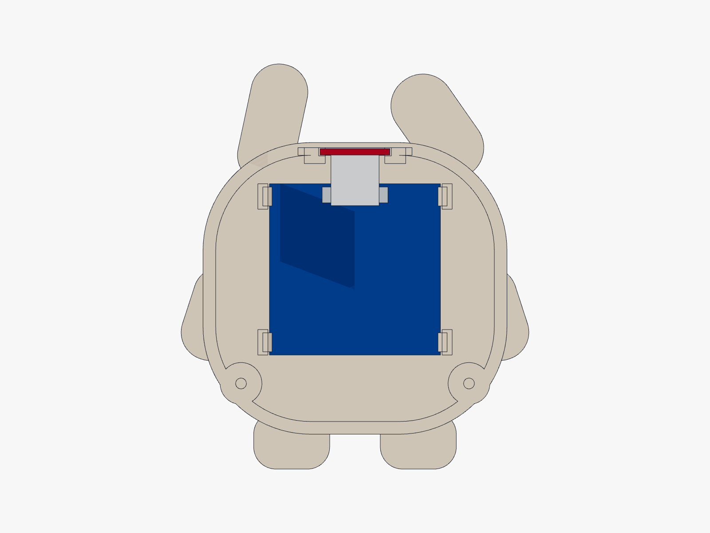

# Piku — push-in OLED, slide-in touch sensor

This is a separate prototype shell revision for the parts in [Piku's build guide](../../Piku-build-guide.docx). The bunny outline, face opening, rear cable opening and two lid screws stay the same. The original hobby kit remains the simpler tape-mount version.

[See the empty holders](Piku-empty-mounts.png) · [Back to Piku](../../README.md)

## How the modules go in

1. **OLED first:** with the back open, lower the display face-first onto its four corner supports. The four ramped tabs are designed to deflect and catch the PCB edges. Apply light pressure only at clear PCB corners; keep pressure off the glass and ribbon. If it binds, stop and adjust the holder parameters. Headers face into the body, at the top of the display.
2. **Touch sensor next:** slide the small red board forward from the rear, sensor side against the crown and components facing the interior. Its long 15 mm dimension runs front-to-back. Two rails capture its outside PCB margins; the three-pin header stays toward the back.
3. **Close the matching lid:** its two small fingers keep the touch board from sliding out. This sensor holder uses the screwed lid as its end stop, so there is no tiny sensor latch to bend.

To remove the OLED, remove the touch board first, ease the OLED tabs outward and lift the PCB a little at a time. Do not pull on the screen or wires. Wire the modules using the [original guide](../../Piku-build-guide.docx) after testing their fit.

## Print the little tests first

| Print | Purpose |
| --- | --- |
| [OLED fit test](cad/piku_oled_fit_test.stl) | Same four supports, clips and viewing aperture; test PCB fit and screen alignment. |
| [Touch fit test](cad/piku_touch_fit_test.stl) | Same rail slot, front stop and crown wall; test sliding fit and touch response. |
| [New body](cad/piku_body.stl) | Full bunny shell with both holders. |
| [Matching back](cad/piku_back.stl) | Lid with the touch-board retaining fingers. |

Use the **same PETG and printer settings** for coupons and body: 0.4 mm nozzle, 0.2 mm layers, 3 walls, 100% scale in millimetres. All STL files are already in their print orientation. Keep support material out of the rail channels and clip gaps; inspect and clean these after printing. The small clip overhangs and rail ledges need a coupon check on your printer. PLA snap durability has not been established here.

The OLED clips are designed for a click as they catch the board, but their holding force and repeated flexing have **not been physically tested**. Successful CAD checks do not establish a working snap fit.

## Dimensions to confirm

| Interface | Model value | Basis |
| --- | --- | --- |
| OLED PCB footprint | 27 × 27 mm | Approximate dimensions from the [selected OLED listing](https://quartzcomponents.com/products/oled-display-0-96-inch-i2c-interface-4-pin-blue-ssd1306). |
| OLED PCB thickness | 1.2 mm | Assumed; measure the bare PCB, excluding glass/components. |
| OLED glass envelope | 26.5 × 19.4 mm; 2.9 mm projection | Assumed for clearance; verify glass edges, active-area offset and exposed corner margins. |
| OLED side / axial allowance | 0.25 / 0.25 mm | Starting print tolerances. |
| OLED catch overlap | 0.4 mm | Each clip overlaps the PCB edge. |
| Touch PCB footprint | 11 × 15 mm | [Selected red TTP223 listing](https://www.dnatechindia.com/red-ttp-223-touch-switch-sensor-module-india.html). |
| Touch PCB thickness / slot | 1.0 / 1.3 mm | Thickness assumed; 0.3 mm total slot allowance. |
| Crown wall at centre | 0.8 mm | Existing thin sensing patch; nominal board-to-roof gap 0.15 mm. |

The module sellers do not specify all the dimensions needed for clips. Check component and solder-joint clearance at the contact margins as well as board thickness. The display sits recessed in this revision to make room for the clip flex span. Check that the complete lit face is visible through the test aperture before printing the body. Parameters and nominal envelopes are in [piku_mounts.py](cad/piku_mounts.py); do not scale the entire shell to compensate for one interface.

## Could Piku run from a battery?

Yes. A suitable architecture for the existing C3 SuperMini is:

**Protected single-cell LiPo → charger with power-path/load sharing + regulated 5 V output → C3 power input.**

The charger’s USB input would sit behind the existing **16 × 14 mm rear opening**, if the selected board and plug fit there. The C3's USB-C port is for power/programming; this design does not add battery charging to that port. Its [listing specifies 5 V USB power](https://quartzcomponents.com/collections/nodemcu-esp/products/esp32-c3-super-mini-development-board-with-soldered-headers-hw-466ab), and does not document a battery charger.

Choose the protected cell and charger together: the charge current must stay within the cell's specified limit. Use a regulator with adequate peak-current headroom; an automatic-shutoff power-bank module must also stay awake at Piku's idle current. If Piku is to run while charging, choose a board that explicitly supports power-path/load sharing. [Adafruit's charger/boost explanation](https://learn.adafruit.com/adafruit-powerboost-1000c-load-share-usb-charge-boost/overview) shows this architecture; that particular board and its charge current have not been selected for Piku.

Do not connect a raw LiPo to the 3V3 pin: a full conventional cell is 4.2 V, above the C3's 3.6 V maximum. See the [Espressif electrical ratings](https://www.espressif.com/sites/default/files/documentation/esp32-c3_datasheet_en.pdf). Disconnect the battery system's 5 V output before using the C3 USB port for programming unless proper reverse-current isolation has been verified. A charger’s load sharing alone does not establish isolation between those two C3 power sources.

There is **no selected battery, charging board, battery holder or power wiring in this revision**. Their combined fit, connector access and charge-current settings still depend on the actual parts. Keep a pouch cell in a smooth insulated holder with space specified by its maker; do not squeeze it between boards or against screw tips. Battery runtime has not been measured.

## What was checked

The [validation report](cad/validation.json) records valid single solids, closed consistently oriented STL meshes, zero body/lid overlap, zero interference with the modeled seated boards, and clear straight insertion paths. OLED insertion was checked against rigid material with its intentionally flexible clips excluded; the clip motion itself was not simulated. The touch insertion path was also checked with the OLED already installed. The nominal component/header boxes help catch layout conflicts; they are not exact purchased-board CAD.

Open [the interior assembly](cad/piku_mount_preview.step) to inspect the blue OLED and red touch board envelopes. It is a review assembly, not a print file. The C3, battery and wiring are not modeled. Sources and STEP files are beside every printable part. Download the STEP or STL files and open them in your CAD viewer or slicer to inspect them locally.
